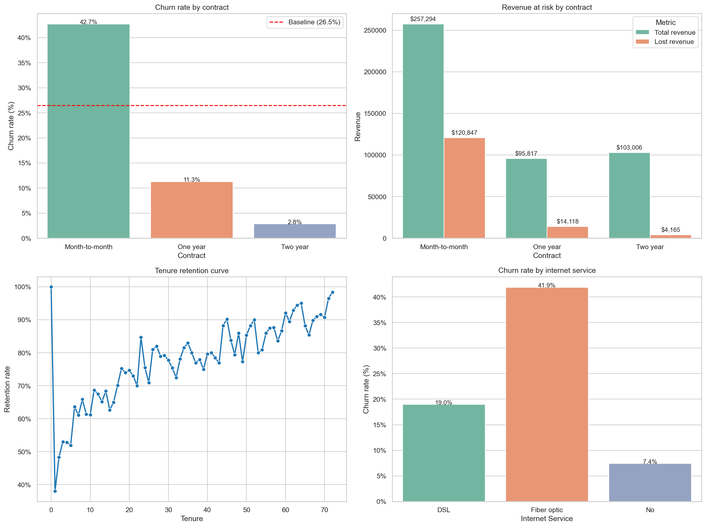

# FUTURE_DS_02 — Customer Retention & Churn Analysis

Data Science & Analytics internship deliverable for **Future Interns** (Task 2 of 3).

This project analyses customer churn for a telecommunications company using the IBM Telco Customer Churn dataset, identifies the segments driving customer loss, quantifies the financial exposure, and builds a logistic regression model to isolate each driver's independent effect.

---

## Key findings

- **Overall churn rate: 26.5%** — roughly one in every four customers leaves.
- **Largest churn driver: fiber-optic internet.** After controlling for all other factors, fiber customers have **3.58× the churn odds** of DSL customers. The premium product has the worst retention.
- **Strongest retention factor: two-year contracts.** Two-year customers have churn odds **0.26× as high** as month-to-month customers — a ~74% reduction.
- **The first year is brutal.** First-year customers churn at 47.4% (1,037 lost customers); retention climbs steadily afterwards and reaches 98% by month 72.
- **Add-on services protect against churn.** Online security (0.72×) and tech support (0.76×) each reduce churn odds by 25–30%.
- **Streaming services are not a retention lever.** Despite intuition, the regression shows streaming TV and movies slightly *increase* churn odds (1.51×).

---

## Dataset

[IBM Telco Customer Churn (Kaggle)](https://www.kaggle.com/datasets/blastchar/telco-customer-churn) — 7,043 customers, 21 columns covering demographics, services, account info, charges, and a binary churn label.

### Cleaning summary

- No duplicates, no explicit null values.
- `TotalCharges` was stored as text due to 11 blank-string entries — all corresponding to brand-new customers with `tenure = 0`. These were filled with 0 and the column was converted to float.
- No other transformations required.

---

## Methodology

1. **Descriptive analysis** — overall churn rate, then segmented by contract, tenure bucket, payment method, internet service, and add-on services.
2. **Financial overlay** — revenue at risk computed by multiplying `MonthlyCharges` by churn status across each segment.
3. **Logistic regression** — to isolate each driver's *independent* contribution to churn, since descriptive segments overlap heavily (e.g. 55% of month-to-month customers have fiber).

### Model setup

- 80/20 stratified train/test split (`random_state = 42`).
- Categorical variables one-hot encoded with `drop_first=True`.
- Logistic regression with `max_iter=2500` to ensure convergence on unscaled features.
- **Test accuracy: 80.6%** (train: 80.6% — no overfitting, well above the 73.5% naive baseline).
- Coefficients interpreted as **odds ratios** via `np.exp()`.

---

## Dashboard

The 2×2 dashboard summarises the four most important findings:



| Panel | Insight |
|---|---|
| **Top-left** | Churn rate by contract type — month-to-month sits far above the 26.5% baseline |
| **Top-right** | Revenue at risk by contract — month-to-month loses $120,847/month to churn |
| **Bottom-left** | Tenure retention curve — climbs from 38% in month 1 to 98% by month 72 |
| **Bottom-right** | Churn rate by internet service — fiber far exceeds DSL |

---

## Repository structure

```
FUTURE_DS_02/
├── data/
│   ├── Telco-Customer-Churn.csv      # Raw source data (Kaggle)
│   └── Churn_Analysis.csv            # Cleaned snapshot used by the model notebook
├── notebooks/
│   ├── 01_inspect.ipynb              # Load, clean, descriptive analysis, dashboard
│   └── 02_model.ipynb                # Logistic regression model & coefficients
├── outputs/
│   ├── dashboard.png                 # Final 2×2 dashboard
│   ├── model_coefficients.csv        # Logistic regression coefficients & odds ratios
│   └── Task2_Report.docx             # Full written report
├── utilities/
│   ├── cleaning.py                   # Reusable cleaning utilities (report, check_categories)
│   └── analyze.py                    # Reusable analysis & plotting functions
├── .gitignore
└── README.md
```

### What's in `utilities/analyze.py`

Aggregations (return DataFrames):

- `get_baseline_churn_rate(df)` — overall churn rate
- `get_churn_by(df, column)` — customer count and churn rate per segment
- `get_lost_revenue(df, column)` — adds total and lost monthly revenue per segment
- `get_retention_curve(df)` — retention rate at each month of tenure

Plots (draw onto a Matplotlib `ax` passed in by the caller):

- `plot_churn_rate_by(churn_df, ax, column, baseline=None)`
- `plot_contract_revenue_risk(contract, ax)`
- `plot_retention_curve(retention, ax)`
- `get_dashboard(...)` — composes all four into the 2×2 dashboard

---

## How to reproduce

1. Clone this repository.
2. Install dependencies: `pip install pandas numpy matplotlib seaborn scikit-learn jupyter openpyxl`
3. Open the notebooks in order:
   - `notebooks/01_inspect.ipynb` — loads the raw data, cleans `TotalCharges`, runs the descriptive analysis, builds the dashboard, and exports `data/Churn_Analysis.csv` for downstream use.
   - `notebooks/02_model.ipynb` — reads the cleaned dataset, fits the logistic regression, and exports the coefficient table to `outputs/model_coefficients.csv`.

---

## Recommendations

1. **Prioritise contract conversion campaigns.** Move month-to-month customers onto longer contracts — this is the single highest-leverage retention lever.
2. **Investigate the fiber-optic experience.** Conduct customer satisfaction surveys and competitive benchmarking; fiber's churn problem is the largest revenue leak in the dataset.
3. **Bundle protective add-on services with new accounts.** Free online security or tech support during the first six months could materially improve first-year retention.
4. **Operationalise the churn-risk model.** Use predicted probabilities to flag high-risk customers for proactive outreach rather than reactive cancellation handling.

---

## Limitations

- Dataset is a single snapshot — no time dimension for cohort or trend analysis.
- No behavioural data (support tickets, payment delinquency, usage patterns), which would likely improve predictive accuracy.
- Descriptive drivers overlap (e.g. fiber and month-to-month), so coefficients cannot be summed naively into expected outcomes for combined interventions.
- The contract-length effect is partly self-selective: customers willing to sign long contracts may already be more committed.
- No data on competitor pricing, marketing campaigns, or regional service quality.

---

## Tools

Python 3.13, pandas, numpy, matplotlib, seaborn, scikit-learn, Jupyter.

---

## Author

Tshilidzi — Data Science & Analytics Intern, Future Interns